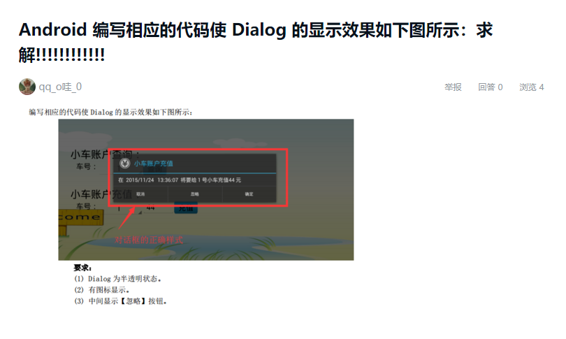

# Dialog Demo

## 要求



## 代码

```java
new AlertDialog.Builder(this)
                // 设置图标
                .setIcon(R.mipmap.ic_launcher)
                .setTitle("小车账户充值")
                .setMessage("给1号小车充值44元")
                .setPositiveButton("确定", null)
                .setNegativeButton("取消", null)
                // 中间按钮
                .setNeutralButton("忽略", null)
                .create()
                .show();
```

## 运行结果

